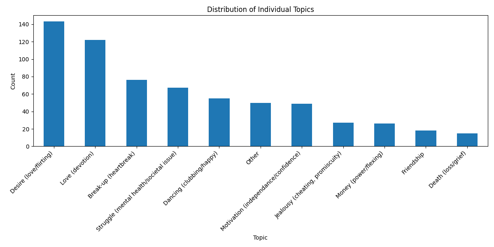
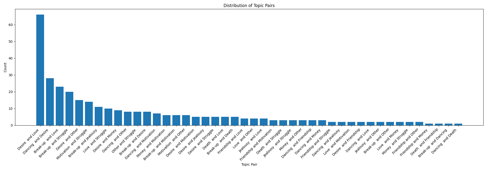

# Model Training

## Kappa Analysis

To run, ensure you are in the home directory. Then run the following command:

```bash
py model_training/kappa_analysis.py
```

Due to an error in our dataset splitting, only datasets_1 (`dataset-christian.db`) and dataset_2 (`dataset-stanley.db`)
contained duplicated entries. Every requirement laid out in the project description was met, (15% of the total instances are duplicated, just not split up correctly).
The error was not caught until after the data was split and recombined.

Thus, we decided to use Cohens' Kappa (Pairwise Agreement between two Annotators). This is a measure of how much two annotators agree on a set of items -- which in this case is
between the duplicated 15% of the two datasets.

Due to the nature of our data annotations, we actually have 4 labels:

    1. `recognized` - the annotator recognized the song just from the lyrics.
    2. `topic1` - the first topics assigned to the song by the annotator. This was not required to be the most 'important', but could be seen as this.
    3. `topic2` - An additional topic assigned to the song by the annotator.
    4. `decade` - the decade in which the annotator thinks the song could have been released.

Due to the nature of our topics, we decided to add some additional variations on the Agreement metrics, as seen in `kappas.py`.

The output of the script is as follows:
```
Binary Agreement  decade
Ordinal Agreement  decade
Binary Agreement  topic1
Binary Agreement  topic2
Setwise Agreement  {topic1, topic2}
Any Intersection Agreement  {topic1, topic2}
```

## Ground Truth Labels

The first question we asked ourselves was which datapoint should be used to train the model: decade or topic. We decided to first begin with topic, since the `Setwise Cohen Kappa`s were relatively high and we found the data more interesting.Note that we will be considering the ground truth label as an _unordered set of 2 topics_. This is because in our annotation guidelines, we did not ask the annotators to order the topics. In other words, the `Setwise Cohen Kappa` best describes the agreement between the two annotators.

With this agreement being 57%, we decided to use an "Adjudication" approach for the remaining 43% of the data. This means that we will manually select the labels we believe to be the most correct between the two annotators.

We used the `ground_truth_labels.py` script to reivew and remove duplicated between the two annotators, then finally, output our ground truth dataset to `model_training/ground_truth_dataset.db`.

Then, to validate (ensure no duplicates) and visualize the dataset, we used the `validate_and_visualize_dataset.py` script.

### Count of Individual Topics



### Count of Topic Pairs


